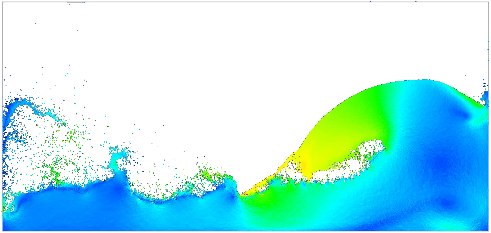

# FlowLab — 2D Fluid Simulator  
*A Bachelor’s thesis / final project in Computer Science*

## 🎯 Overview  
FlowLab is a 2D fluid dynamics simulator built as part of my [Bachelor’s thesis](./docs/thesis.pdf) at the University of Freiburg. It allows users to visualize and experiment with fluid behavior in a 2D environment, using particle-based techniques.

This repository hosts:
- The full source code  
- The executable (in the latest release)  
- The full [thesis](./docs/thesis.pdf) document  
- Examples, images, and demo videos  

## 🚀 Demo & Media  
**Video demo:**  

## 🧱 Features  
- Basic 2D fluid simulation 
- Real-time visualization & user interaction
- Adjustable parameters: viscosity, time step, boundary conditions 

## 🏗️ Architecture & Implementation  
Here’s a rough breakdown of the system:

- **Core simulation module** — e.g. solves momentum, diffusion, advection  
- **Data structures** — neighbor search  
- **Rendering / visualization** — OpenGL  
- **I/O & persistence** — loading / saving scenes, exporting images & videos  

You can also refer to the [thesis](./docs/thesis.pdf) for in-depth mathematical derivations and implementation details.
