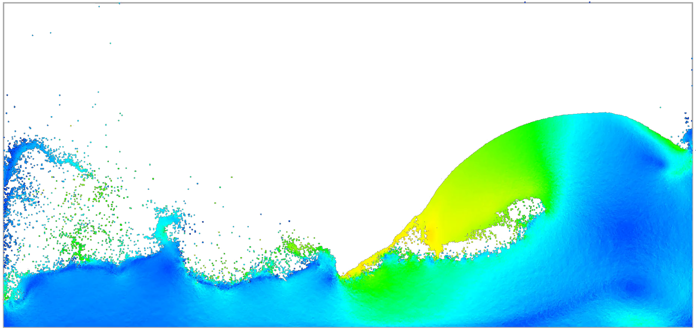

# FlowLab — 2D Fluid Simulator  
*A Bachelor's Thesis Project in Computer Science*

## 🎯 Overview  
**FlowLab** is a 2D fluid dynamics simulator developed as part of my [Bachelor’s thesis](./docs/thesis.pdf) at the **University of Freiburg**.  
It allows users to visualize and experiment with fluid behavior in a 2D environment using **Smoothed Particle Hydrodynamics (SPH)** techniques.

This repository contains:
- The complete source code  
- The executable (available in the [latest release](https://github.com/Meith0717/FlowLab/releases/latest))  
- The full [thesis](./docs/thesis.pdf) document  
- Example media and a demonstration video  

---

## 🚀 Demo & Media  
**Video demo:**  

---

## 🧱 Features  
- Implementation of both **Standard SPH (SESPH)** and **Implicit Incompressible SPH (IISPH)**  
- Real-time 2D particle-based fluid simulation  
- Interactive visualization and parameter tuning  
- Adjustable parameters: viscosity, time step, boundary conditions  
- Basic support for saving and reloading simulation states  

---

## 🏗️ Architecture & Implementation  
The simulator is structured into modular components:

- **Simulation Core** — Implements both SESPH and IISPH formulations  
  - SESPH for direct density and pressure computation  
  - IISPH for solving incompressibility via a linear system (pressure Poisson equation)  
- **Neighbor Search** — Spatial hashing-based system for efficient particle neighborhood queries  
- **Rendering** — OpenGL-based real-time visualization of particles and fields  
- **I/O & Persistence** — Loading/saving of scenes and exporting simulation frames  

For detailed mathematical derivations and algorithmic explanations, refer to the [thesis](./docs/thesis.pdf).

---

## 📁 Getting Started  

### 🧩 Requirements  
- Windows (tested)  
- .NET 8.0 or newer  
- OpenGL-compatible GPU  

### ⚙️ Running the Executable  
You can download the latest version from the [Releases page](https://github.com/Meith0717/FlowLab/releases/latest).  
Simply extract and run `FlowLab.exe`.

---

## 📄 Thesis & Documentation  
The thesis includes:
- A detailed introduction to SPH and IISPH  
- Algorithm derivations and solver design  
- Comparison between SESPH and IISPH in terms of performance and stability  
- Discussion of implementation challenges and results  

---

## 🧪 Results  
FlowLab demonstrates that the **IISPH** approach achieves improved stability and volume preservation compared to the **standard SPH** implementation, at the cost of additional computational complexity due to solving the pressure system iteratively. 

---

## 🕹️ Controls & Keybinds  

| Key / Combination | Action |
|-------------------|--------|
| **Esc** | Exit application |
| **Del** | Delete all particles |
| **Space** | Toggle pause / resume simulation |
| **B** | Switch between build and simulation modes |
| **Q** | Cycle through particle source shapes |
| **V** | Load next scene |
| **T** | Run tests |
| **C / Y** | Adjust boundary rotation (increase / decrease) |
| **X** | Reset boundary rotation |
| **F11** | Toggle neighbour search debug view (if debug mode active) |

### Modifier combinations  
| Key Combination | Action |
|-----------------|--------|
| **Alt + F12** | Toggle debug mode |
| **Alt + Enter** | Toggle fullscreen |
| **Ctrl + W / S** | Fast height adjustment (increase / decrease) |
| **Ctrl + A / D** | Fast width adjustment (decrease / increase) |
| **Ctrl + C / Y** | Fast boundary rotation adjustment (increase / decrease) |

---

## 🪪 License  
MIT License — see [LICENSE](./LICENCE).

---

These controls allow you to modify emitter properties, control the simulation state, and switch visualization modes in real time.

---

## 👤 Author  
**Thierry Meiers**  
University of Freiburg

